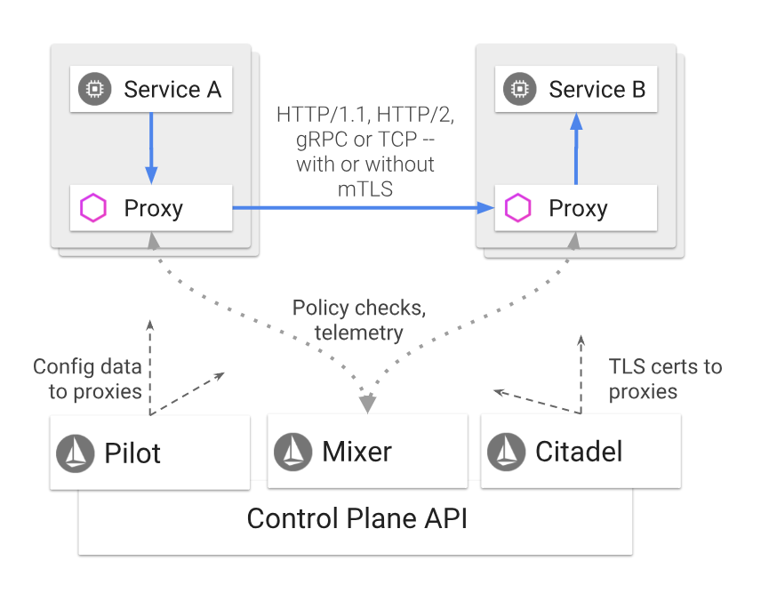
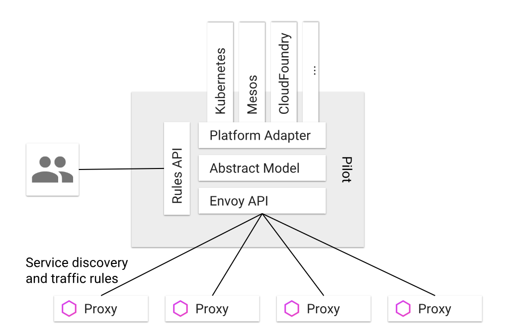
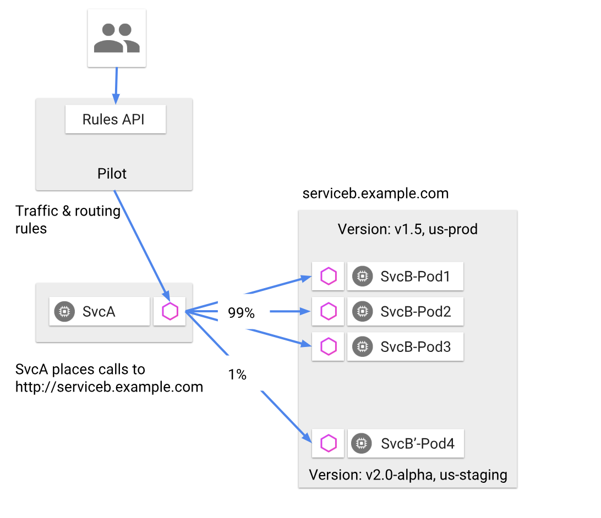
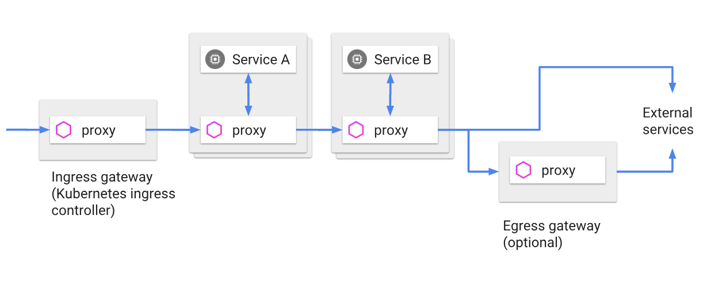
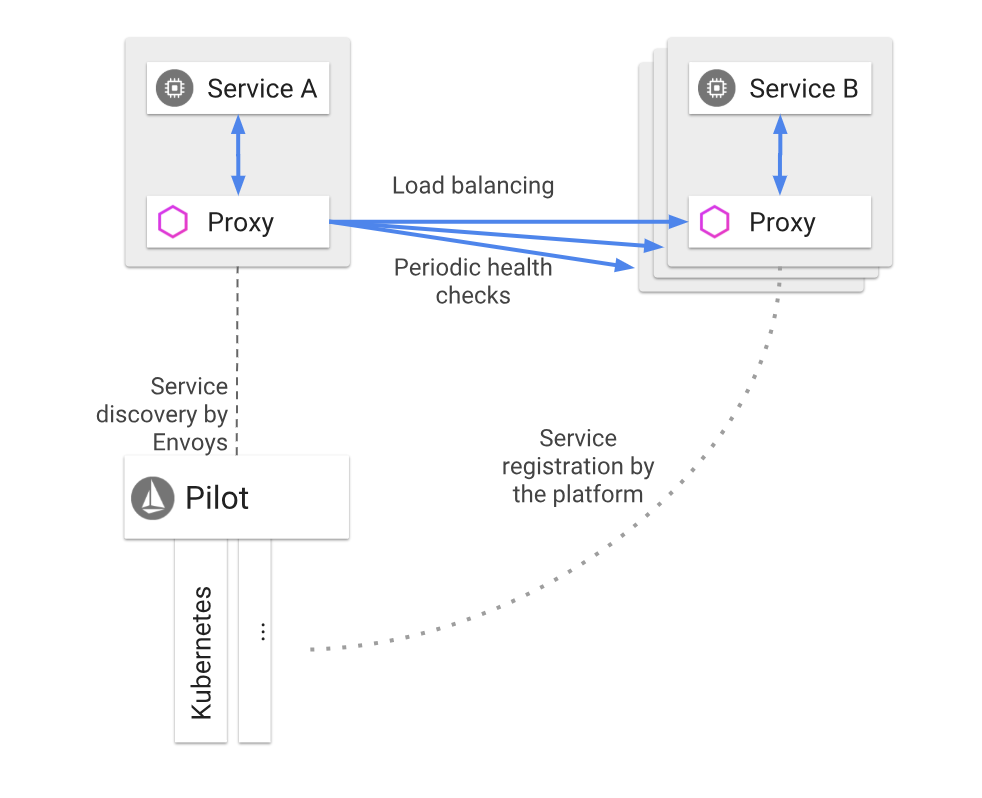
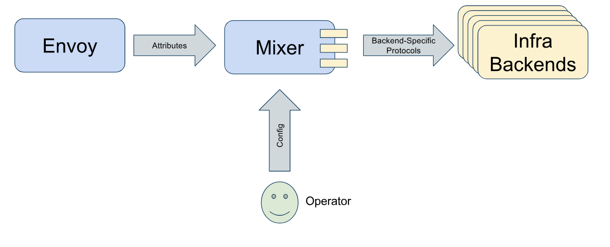
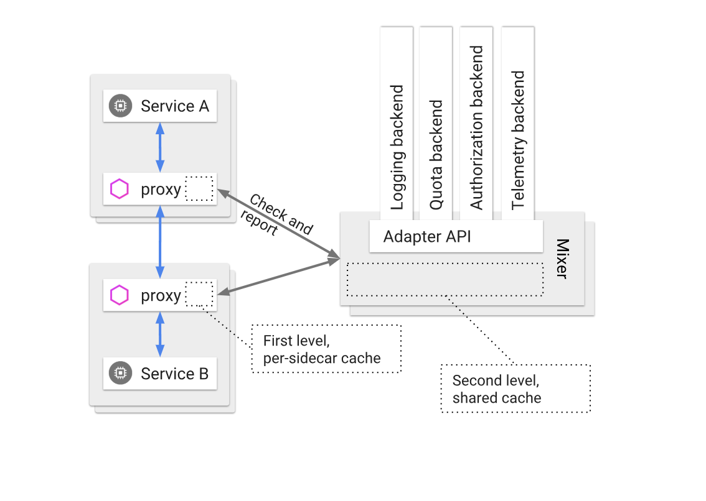
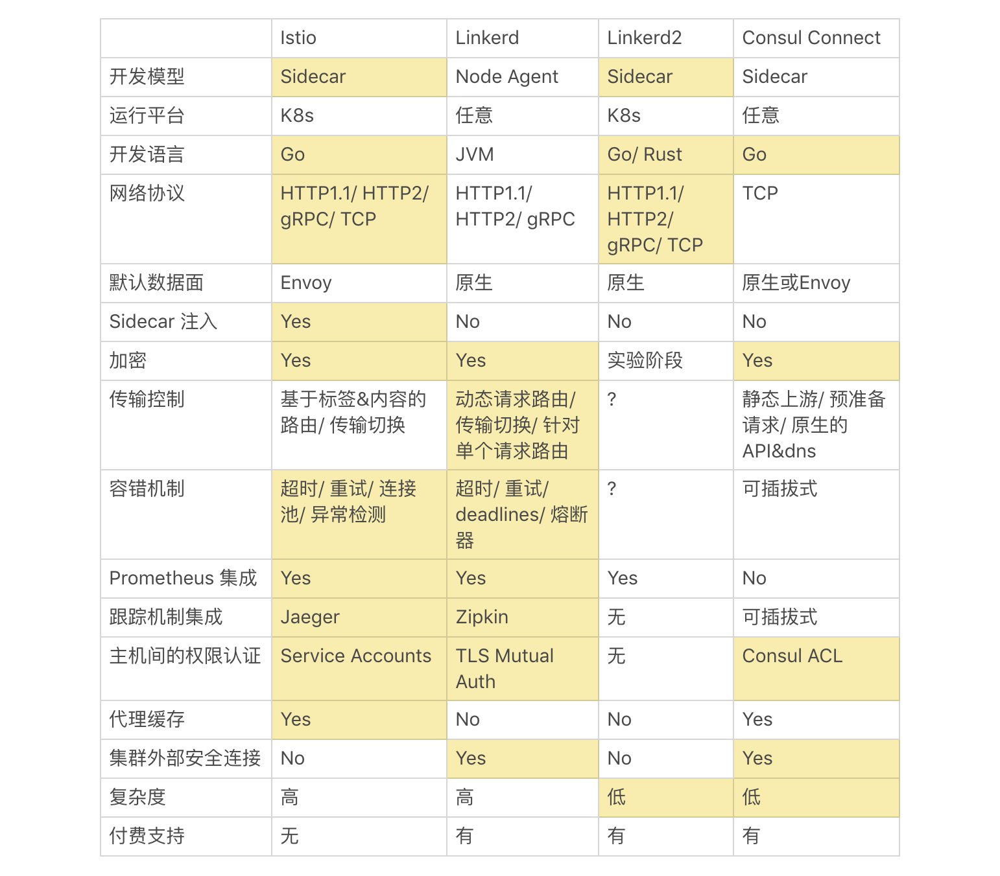

# Istio 深入调研报告
_Made By XinyaoTian_

## Istio 的起源

为了实现由 William Morgan 提出的微服务 Service Mesh 模式和诸多理念，Google , IBM 和 Lyft 这三家公司协同研发，并于 2017 年 6 月 8 日( 根据 Github 最后一次提交的时间 )发布了 Istio 的第一个发行版——Istio 0.1 版本。

## Istio 的设计目标 

作为一款 Service Mesh 模式的实现，Istio 最根本的设计目标就是实现 Service Mesh 的设计构想：

- __将“应用程序”与“网络”解藕__:
将服务之间、服务与集群外部的网络通讯和安全机制从微服务的业务逻辑中解藕，并作为一个与平台无关的、独立运行的程序，以减少开发和运维人员的工作量。

- __保障网络环节__:
应用程序的目标是“将某些东西从A传送到B”，而 Service Mesh 所要做的就是实现这个目标，并处理传送过程中可能出现的任何故障。

- __提供应用层面的可见性和可控性__:
通过每个微服务中的 Sidecar ，Service Mesh 得以将服务间通信从底层的基础设施中分离出来，让它成为整个生态系统的一个独立部分——它不再是单纯的基础设施，更可以被监控、托管和控制。

除此之外，Istio 还有着其他更加关键的设计目标，这些目标对于使系统能够应对大规模流量和高性能地服务处理至关重要。

- __最大化透明度( 与“解藕”类似，但具体到基于 Pod 实现 )__:
Istio 使用 Sidecar 代理来捕获流量，并且在尽可能的地方自动编程网络层，以路由流量通过这些代理，而无需对已部署的应用程序代码进行任何改动。注入 sidecar 代理到 pod 中并且修改路由规则后，Istio 就能够调解所有流量。

- __增量扩容策略__:
扩展策略系统，集成其他策略和控制来源，并将网格行为信号传播到其他系统进行分析。策略运行时支持标准扩展机制以便插入到其他服务中。

- __可移植性__:
Istio 必须能够以最少的代价运行在任何云或预置环境中。将基于 Istio 的服务移植到新环境应该是轻而易举的，而使用 Istio 将一个服务同时部署到多个环境中也是可行的（例如，在多个云上进行冗余部署）。

- __策略一致性__:
在服务间的 API 调用中，策略的应用使得可以对网格间行为进行全面的控制，但对于无需在 API 级别表达的资源来说，对资源应用策略也同样重要。策略系统作为独特的服务来维护，具有自己的 API，而不是将其放到代理或 Sidecar 中，这容许服务根据需要直接与其集成。

## Istio 的核心功能

Istio 的核心功能有以下五点：

- __流量管理__:
Istio 通过 Pilot 所提供的 API 动态地配置所有 Pod 中 Sidecar 的路由规则，进而控制服务间的流量和 API 调用。Istio 简化了断路器、超时和重试等服务级别属性的配置，并且可以轻松设置 A/B 测试、金丝雀部署和基于百分比的流量分割的分阶段部署等重要任务。

- __安全__:
Istio 提供给开发人员应用程序级别的安全性。Istio 提供底层安全通信信道，并大规模管理服务通信的认证、授权和加密。使用 Istio ，服务通信在默认情况下是安全的，它允许跨多种协议和运行时一致地实施策略——所有这些都很少或根本不需要应用程序更改。将 Istio 与 Kubernetes 的网络策略结合使用，其优势会更大，包括在网络和应用层保护 Pod 间或服务间通信的能力。

- __可观察性__:
Istio 的 Mixer 组件负责策略控制和遥测收集。通过 Istio 的监控功能，可以了解服务性能如何影响上游和下游的功能；其自定义仪表板可以提供对所有服务性能的可视化，从而了解性能如何影响其他进程。

- __平台独立__:
Istio 是独立于平台的，旨在运行在各种环境中，包括跨云、内部部署、Kubernetes、Mesos 等。您可以在 Kubernetes 上部署 Istio 或具有 Consul 的 Nomad 上部署。

- __集成和定制__:
策略执行组件可以扩展和定制，以便与现有的 ACL、日志、监控、配额、审计等方案集成。

## Istio 的实现原理

### Istio 的架构

- Istio 的架构在逻辑上分为“控制面”和“数据面”。

“数据面“：由一组 Sidecar 构成。这些 Sidecar 可以调节和控制微服务及 Mixer 之间所有的网络通信。

“控制面“：负责管理和配置代理路由流量。此外，控制面通过 Mixer 来实施策略和收集各个 Sidecar 的遥测数据。( 具体见下文 )
架构图如下：

### Istio 架构中每个部分的作用

- Sidecar ( 在 Istio 中，默认的 Sidecar 是 Envoy )

Envoy 是使用 C++ 开发的高性能代理，用于调解服务网格中所有服务的入站和出站流量。在 Istio 中，Envoy 被用于 Sidecar ，和对应的应用服务部署在同一个 Kubernetes 的 Pod 中。

Envoy 调解所有出入应用服务的流量。所有经过 Envoy 的流量行为都会调用 Mixer，为Mixer 提供一组描述请求和请求周围环境的 Attribute 。根据 Envoy 的配置和 Attribute，Mixer 会调用各种后台的基础设施资源。而这些 Attribute 又可以在 Mixer 中用于决策使用何种策略，并发送给监控系统，以提供整个网格行为的信息。

- Pilot

Pilot 为 Sidecar 提供“服务发现”功能，并管理高级路由( 如 A/B 测试和金丝雀部署 )和故障处理( 超时、重试、熔断器等 )的流量。Pilot 将这些“高级”的流量行为转换为详尽的 Sidecar (即 Envoy) 配置项，并在运行时将它们配置到 Sidecar 中。

Pilot 将服务发现机制提炼为供数据面使用的 API ，即任何 Sidecar 都可以使用的标准格式。这种松耦合的设计模式使 Istio 能在多种环境( Kubernetes、Consul 和 Nomad )下运行，同时保持用于流量管理操作的相同。

- Mixer

Mixer 是一个独立于平台的组件，通过从 Sidecar 和一些其他服务处收集数据，进而在整个 Service Mesh 上控制访问和执行策略。Sidecar 请求级别的 Attribute 被发送到 Mixer 进行评估。( 关于 Attribute 的定西，详见下文 )

Mixer 中还包括一个灵活的插件，使其能接入各种主机环境和基础设施的后段，并得到 Sidecar 代理和 Istio 所管理的服务。

__Mixer 的设计还具有以下特点__：
1. 无状态：Mixer 本身是无状态的，它没有持久化存储的管理功能。
2. 高可用：Mixer 被设计成高度可用的组件，任何单独的 Mixer 实例实现 > 99.999% 的正常运行时间
3. 缓存和缓冲：Mixer 能够积累大量短暂的瞬间状态 
> ( 其能够作为 Envoy 的二级缓存，见 Attribute 与服务监控 )

- Citadel

Citadel 通过内置身份和凭证管理提供“服务间”和“最终用户”身份验证。Citadel 可用于升级服务网格中未加密的流量，并能够为运维人员提供基于服务标识( 如 Kubernetes 中 Pod 的标签或版本号 )而不是网络层的强制执行策略。

### Istio 与 Envoy 的关系
> ( 见 Istio 部分功能和工作流程 的 流量管理 部分 )

Istio 与容器管理平台的关系 (  以 K8s 为例 )

从设计上来说，Istio 是平台无关的，它可以在许多容器管理平台上部署。但是当 Istio 与 Kubernetes 共同使用时，它的能力将得到最大化应用。

比如，Istio 可以通过 yaml ( Istio 有提供 yaml )的形式快速在 K8s 上部署；其服务注册机制由 K8s 提供，而服务发现由 Istio 中的 Pilot 负责。

综上所述，在 Kubernetes 上使用 Istio 是非常合适的，具体四种 Service Mesh 的各种功能特性对比见 下文。

## Istio 部分功能的工作流程

### 流量管理及请求路由

将流量从应用程序中解藕，使得 Istio 能提供各种流量管理的功能，例如：动态路由( 负载均衡，A/B 测试，金丝雀部署 )、故障处理( 超时，重试，熔断器，故障恢复 )以及故障注入( 测试服务之间的故障恢复策略的兼容性 )。这些都是通过 Pilot 与 Sidecar 共同协作完成的。

(上图: Pilot 的构成及其与 Sidecar 协同工作原理示意)

由上图可以看出，一个 Pilot 主要由“平台适配器”、“抽象模型”、用于配置和调用 Envoy 的“Envoy API” 和 用于用户指定流量管理规则的“Rules API”所组成。

__Sidecar 的服务发现及传输规则机制，主要遵循以下流程__：

1. 平台适配器( Platform Adapter )从 Kubernetes API server 中获取 Pod 的注册信息。( 注意：Istio 本身并不具备服务注册的功能，它需要通过平台适配器和特定的平台结合才能具有完整的服务发现的功能。)
2. 用户通过 Pilot 的 Rules API 对所有被发现的服务的 Sidecar 进行各种高级特性( 包括路由规则、HTTP层的流量管理等 )的配置
3. 用户配置的这些规则被抽象模型翻译成低级配置
4. Sidecar API(即 Envoy API) 将这些翻译好的低级配置通过 discovery API 分发到每个微服务上的 SIdecar(即 Envoy) 实例中

### 服务间通讯

运维人员可以用 Pilot 指定路由规则，而 Envoy 根据这些规则动态地确定其服务版本的实际选择。Envoy 拦截并转发客户端和服务器之间的所有请求和相应。路由规则让 Envoy 能够根据诸如 header、source/destination 或分配给每个版本的权重等标准来进行版本选择。

__Service A 访问不同版本的 Service B 的工作流程如下__：
1. 运维人员通过 Polit 的 Rules API 根据 destination 的相关标签配置分流规则
2. Service A 运行时，其 Envoy 的配置规则更新
3. Service A 根据新配置的规则访问带有不同标签的 Service B 的版本

### 集群出入站规则

Istio 默认进入和离开网络的所有流量都会通过 Envoy 进行传输。通过 Envoy 将流量路由到外部 Web 服务( 例如访问 Maps API 或 视频服务 API )的方式，运维人员可以为这些服务添加超时控制、重试、熔断器等功能；还能从服务连接中获得各种细节指标。

__流量从外网进入集群再流出的流程如下__：
1. 通过 Kubernetes 的准入控制，外部流量进入 Istio
2. 流量与 Service A 和 Service B 的 Envoy 交互，并由 Envoy 获取服务具体相应的内容
3. 流量通过 Egress gateway 或 直接流出的方式流出 Istio

### 服务发现和负载均衡
Istio 的服务注册功能是基于平台来实现的。Istio 默认存在用于跟踪 Pod 的服务注册表，而且还默认新的服务自动注册，不健康的服务被自动删除。目前，Kubernetes、Mesos 等平台已经为基于容器的应用程序提供了这样的功能。

Pilot 使用服务注册的信息，并提供与平台无关的 discovery API。网格中的 Envoy 提供服务发现功能，并相应地动态更新负载均衡池。

__运行流程如下__：

1. 每个微服务的 Pod 通过 Kubernetes 提供的服务注册机制进行注册
2. 已注册的 Service A 的 Envoy 通过 Pilot 中汇总的 Envoy 信息发现欲访问的 Service B
3. Service A 的 Envoy 根据设置好的负载均衡或流量管理规则，对 Service B 的 Envoy 发起请求
4. Service B 的 Envoy 根据设置好的规则确认是否接收 Service A 发出的请求。

### Attribute 与服务监控

Attribute 是 Istio 策略和遥测功能中的基本概念。Attribute 是一小段数据，用于描述服务请求的一系列属性( 例如特定请求的大小、操作相应代码、请求来自的 IP )；通过 Attribute，我们就可以洞悉服务的方方面面。

Mixer 是 Istio 中用于实现策略和遥测功能的组件，其本质上是一个 Attribute 处理机。每个经过 Sidecar 的请求都会调用 Mixer，为 Mixer 提供一组描述请求及其周围环境的 Attribute。基于 Envoy 的配置和相应 Attribute，Mixer 会调用各种基础设施后端。

__遥测功能的信息汇总流程如下( 注意所有微服务都是通过 Envoy 进行通信的 )__：

1. Envoy 通过调用将 Attribute 传递给 Mixer
2. Mixer 得到 Envoy 的 Attribute，并根据 Attribute 调用各种后端资源
3. 同时，Mixer 可以汇总所有 Envoy 的 Attribute，用于集群范围的监控以及为运维人员提供可观测性

位于网格中每个服务实例旁边的 Sidecar 代理必须在内存消耗方面节约，这限制了本地缓存和缓冲的可能数量。然而，Mixer 独立运行，可以使用相当大的缓存和输出缓冲区。因此，Mixer 可用作 Sidecar 的高度扩展且高度可用的二级缓存。

## Istio 与目前其他主流 Service Mesh 的比较

目前，市面上有许多 Service Mesh 的实现。我们这里挑选 4 种当前最主流的 Service Mesh，对其诸多方面( 包括功能特性、支持平台、是否付费等 )进行横向对比，用以说明 Istio 所存在的优势和不足。

__Istio, Linkerd, Linkerd2 和 Consul 四种 Service Mesh 的横向对比__
> ( 黄色表明目前在该特性上处于优势态 )

根据上表所示，目前选择 Istio 作为 Service Mesh 的主要优劣势如下：

### 优势：
1. 使用 Sidecar 模式开发，便于流量控制和监测及安全机制
2. 与 K8s 完美兼容
3. 使用高性能的 Go 语言开发
4. 支持多种高级快速的网络协议
5. Sidecar 默认 Envoy 并自动注入
6. 容错机制完善
7. 集成了用于监测的可视化界面
8. Jaeger 作为跟踪机制集成
9. 具备权限认证功能
10. Sidecar 代理具有缓存功能
11. 完全免费
12. 文档和技术博客数量远多于其他 3 种 Service Mesh

### 劣势：
1. 复杂度高，技术门槛和学习成本高
2. 目前 Istio 不支持集群内外通信的安全连接

